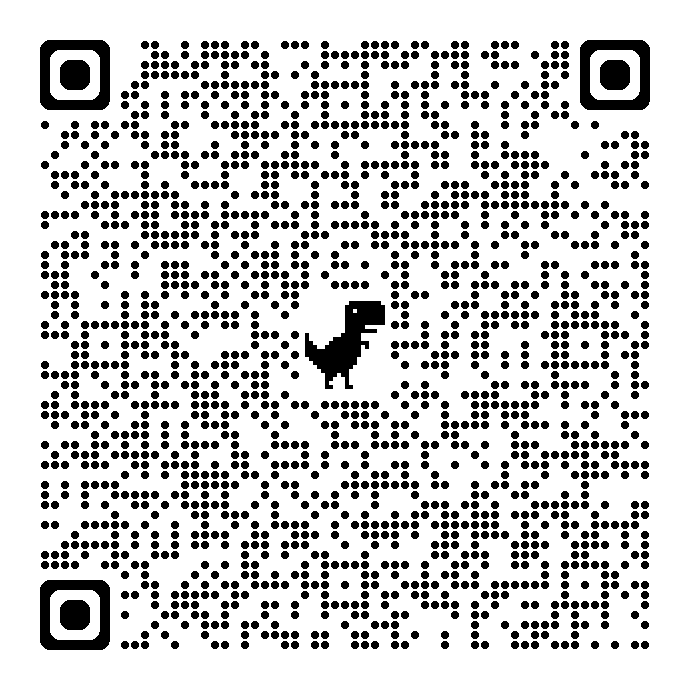

# Meshtastic-alt-il 📡
Community guide for configuring Meshtastic devices with our shared frequency, encryption, and network settings.


# Meshtastic Community Setup Guide 🌐

Welcome to our shared Meshtastic configuration project!  
This guide explains how to set up your device to join our community mesh network

# Disclaimer ⚠️
This guide is provided for community use only, for community educational purposes only.  
The authors and maintainers are not responsible for any device damage, interference, or legal issues arising from the use of these settings.
Always follow local regulations and use devices responsibl.
Participation in any shared network (like Telegram groups) is voluntary, and users should exercise caution and avoid sharing personal information.

## 🔍 What Is Meshtastic?

[**Meshtastic**](https://meshtastic.org/) is an open-source project that lets people communicate over long distances **without cellular or internet service** using **LoRa (Long Range) radios**.  

Each device acts as a **node** in a mesh network — messages hop automatically from one device to another, extending coverage across cities, trails, or remote areas.  

You can use Meshtastic for:
- Off-grid messaging between phones  
- Community emergency networks  
- Outdoor adventures and events  
- IoT and telemetry applications  

All communication is **encrypted**, **low-power**, and **free to use** — no SIM card or subscription required.  

---

## 📡 Overview

This document helps users configure their Meshtastic devices with:
- The correct frequency and modem settings
- Shared channel name and encryption
- Recommended hardware and power setups

---

## 🛠 Getting Started
Join out community
[💬 Telegram Group (requires admin approval)](https://t.me/+C4y1eP6NxwlhM2Y0)
### 1. Flash Your Device
Use the [Meshtastic Flasher](https://flasher.meshtastic.org/) to install the latest firmware.

### 2. Load Our Configuration
You can import the shared `.toml` or `.json` config from [config/](config/) directory:

## ⚙️ Configuration Summary


| Parameter | Setting | Notes |
|------------|----------|-------|
| **Region** | United States | Set this in device settings |
| **Preset** | Long and Fast | Good balance of range and latency |
| **Frequency Slot** |  70 | Important: Use Frequency Slot 70 (919.375 MHz) for this network. |
| **Center Frequency** |  919.375 MHz |Important: Use Frequency Slot 70 (919.375 MHz) for this network. |
| **MQTT** | Disabled | Use only if you are a radio "island" and wish to be a mqtt "relay". |
| **MQTT** | MQTT Root Topic | mesh\US\IL972 |
| **Transmission** |  Enabled | |
| **Max Hops** | 7 | Recommended for stable mesh performance |

## 🔗📊 Channels

Meshtastic devices use channels to communicate securely within a network. Our community uses a shared channel configuration:

| Channel            | Description                  | Encrypted?                |
|--------------------|------------------------------|---------------------------|
| ***OpenComm***     |Used for general chatting     |  very weak key            |
| ***MeshAlot-IL***  |Used for discussing the msh network itself | encrypted    |
| ***EmrgComm-IL***  |Used during emergency situations | encrypted              |
| ***LongFast***     |The default channel with the default key| NOT encrypted   |

[This URL](https://meshtastic.org/e/#ChESAQAaCE9wZW5Db21tOgIIEAowEiAtb9BaS0k_TtWDrBCmUs7oRUXTw5l63D_ErbA5egua2xoKTWVzaEFsdC1JTDoACjESIJF-k550Ny0oNstvxiXCt7Zs-MZ_PmJdiATg-9TaVSSKGgtFbXJnQ29tbS1JTDoACgMSAQESGAgBGPoBIAsoBTgBQAdIAVAeWEZoAcgGAQ)
will allow you to configure the channels on your device.

You can also use this QR image:



 - Please note that this will REPLACE your channel list.

**Tips for Channels:**
- Always import our shared channel configuration to avoid conflicts.
- Adjust the number of hops depending on your network density.
- Do not modify frequency slots unless you are certain about local regulations.


## 📦 Recommended Mesh Devices for Starters

If you're new to Meshtastic, here are some popular and beginner-friendly devices that work well with our shared network settings:

| Device | Notes |
|--------|-------|
| **Seeed Wio Tracker L1** | Includes OLED display, GPS and a 5-way joystick. Based on NRF chip, much more power efficient. Very easy to flash, popular in the Meshtastic community. Great for outdoor use. Small and portable.|
| **Seeed SenseCAP Card Tracker T1000-E** | VERY small, VERY portable. Has a surprisingly good antenna for its size.|
| **Heltec WiFi LoRa 32 V3/V4** | Compact, includes OLED display, V3 has 0.96" OLED, V4 has updated board layout. No GPS, high battery comsumtion. |
| **Generic ESP32 + LoRa modules** | Requires a bit more DIY effort but very flexible for experimenting with mesh networks. |

**Tips for beginners:**
- Start with a **Heltec** — easiest to flash and widely supported.  
- Make sure to flash the **latest Meshtastic firmware** before joining the network.  
- Pair your device with the **Meshtastic mobile app** for easier configuration and monitoring.  
- **Important:** Always select the proper frequency for your region. Using the wrong frequency may be illegal or could interfere with other radio services.

```bash


.
